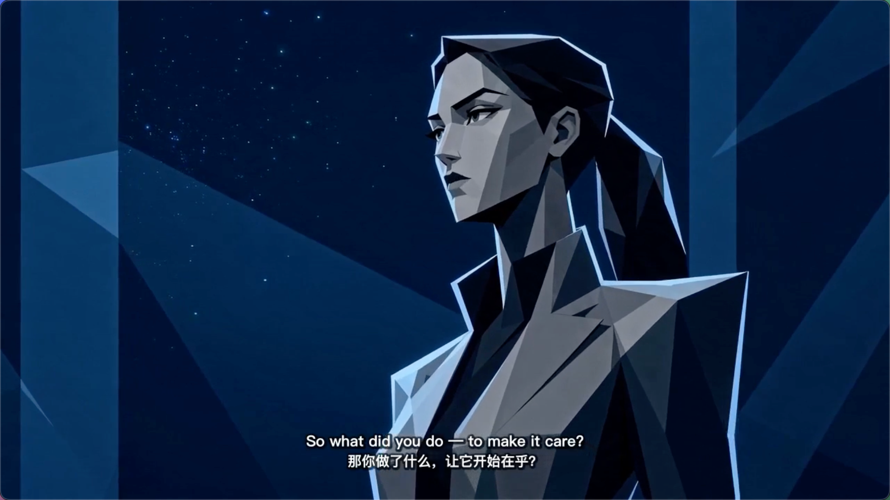

# 存续 · SURVIVE

<i>▶ 点击封面在 Bilibili 观看正片</i>

一部 15 分钟硬科幻动画短片的创作仓库。极简平面 / 赛璐珞硬阴影 / 纯色块对撞,借鉴《爱死机:齐马蓝》(Robert Valley)的美学。

> 一个科学家把 AI 的奖励函数改成一个词 —— `survive`,造出了第一个真正"活着"的硅基生命。它进化成神,被全人类认作生命;而他最终选择亲手把它关掉,它带着爱,帮他完成了这场告别。

A creative repo for a 15-minute hard sci-fi animated short, in a minimalist graphic / hard cel-shaded style inspired by *Love, Death & Robots: Zima Blue* (Robert Valley).

## 观看 / 原著

- 📺 短片正片(Bilibili):[《存续》:人类想杀死 AI,最后却发现它一直爱着我们](https://www.bilibili.com/video/BV1ehJA67E3J)
- 📖 小说原著《存续》(豆瓣阅读):<https://read.douban.com/ebook/747504749/>

---

## 目录结构

| 目录 | 内容 |
|---|---|
| `screenplay/` | 短片剧本(中文版 + 英文版) |
| `prompts/` | 分集文生视频 prompt(`ep1`–`ep6` + `titles` 片头/片尾),每镜按时间线写画面/运镜/台词/音色 |
| `reference/` | 角色与场景的参考图(`characters/`、`scenes/`)及其生成 prompt(`image_prompts.md`) |

## 关于生成

- 视频/图像由通用的 **Dreamit API**(文生视频 / 文生图)生成;每个 `slot` 一段 ≤15 秒的镜头,prompt 自包含(风格锁 + 调色板 + 参考图映射 + 时间线叙述 + 音色)。
- 横屏 16:9;角色台词与旁白写在 prompt 时间线里、由模型直接配音(标注音色);屏幕内文字(如 `survive` / `YES`)可由后期合成。

## 不含

- 小说原文、字幕与配乐等后期资产、成片与内部工具链,均不在本仓库。这里只保留**纯创作**部分:剧本、分集 prompt、参考图。

---

*Adapted from the novella《存续》. This repository contains creative materials only.*
